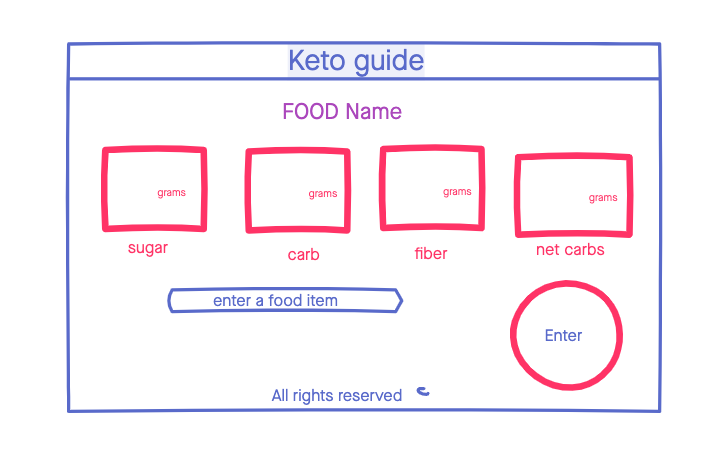

# Keto Calculator

A simple web app that visualizes Keto-specfic nutritional facts for items at a restaurant.

## Technologies
- HTML5
- CSS3
- Javascript
- JQuery
- Nutritionix API

## Wireframe / Screenshots

## Getting Started
[Click Here](https://teamhexx.github.io/Keto-Calculator/) to get started, and type a restuarant to search for carbs, sugars, fiber and calories for each food item.

## Future Enhancements
- Add sort by item name
- Add net carbs (by subtrating carbs - fiber)
- Visualize net carbs
